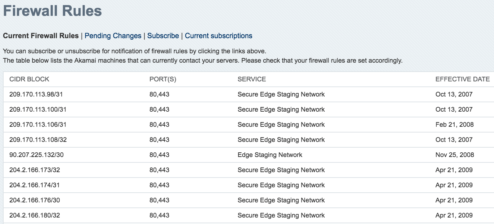
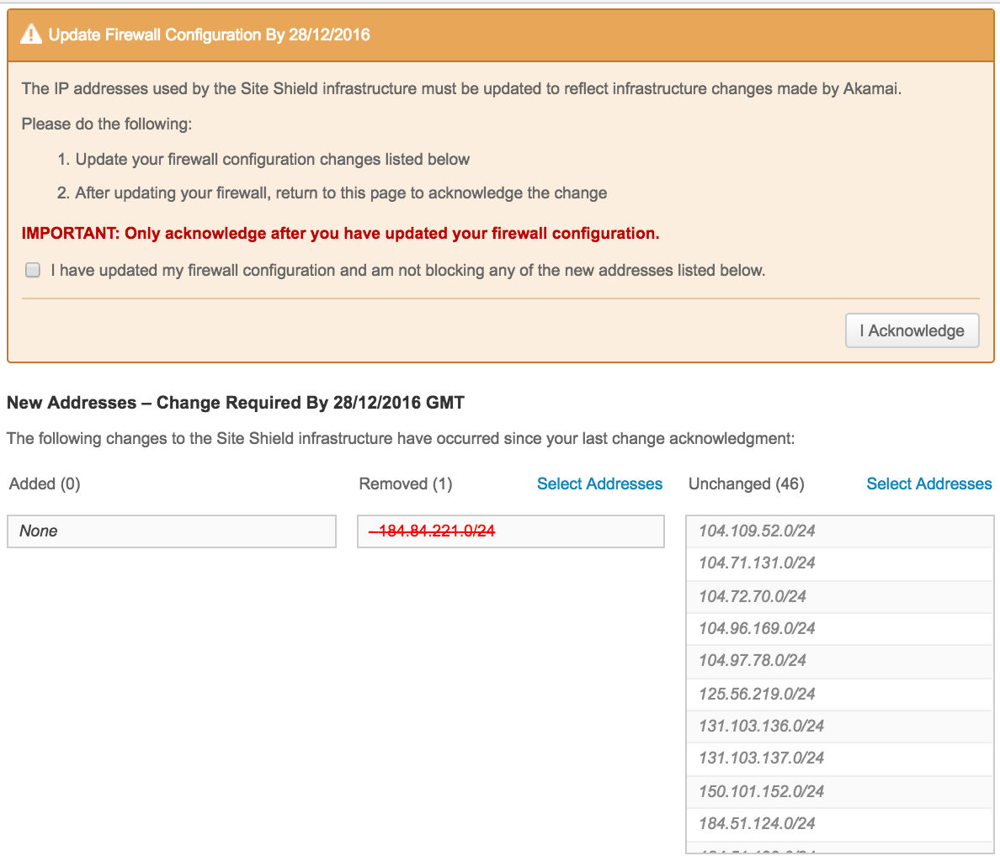

# SSSG Ninja

## Overview
Site Shield is the fancy name for IP white listing of Akamai, it provides an additional layer of protection that helps prevent attackers from bypassing cloud-based protections to target the application origin. 

Security Group is the security component of AWS, it acts as a virutal firewall for insstances to controls the inbount/outbound traffics.

The typical setting is to add all site shield cidr into security groups, then associate them with the ELB (Elastic Load Balancer). Due to the large number of the site shild cidr and the AWS limits on inbound rules per security group (default 50) and security groups per network interface (default 5). The best practice is to use nested security group - managing the site shield cidr in a couple of security groups, then use those security groups as the sources cidr in one security group which is assoicated with the ELB. 

But with the frequent site shield cidr updates (add or remove cidr) and the different acknowledge order for add and remove operations, it becomes difficult to keep the security groups up to date. Also you have to keep track of the security group usage, as it may reach the limits.

SSSG Ninja is the all-in-one managemenet tool for SSSG (Site Shield Security Group), it not only makes recommendations but also can do the jobs for you. Here are current supported features:

- [x] Make recommendations based on health check
- [x] Add missed site shield cidr to security groups
- [x] Add new site shield cidr to security groups
- [x] Remove obsolete site shield cidr from security groups
- [x] Check the security group limits
- [x] Check site shield map information
- [x] Search cidr in security groups
- [x] Acknowledge site shield change
- [x] Debug mode logging

## Terminologies
If you want to deep dive into the tool, here are a few terms you need to know  

| Terminology       | Description            
| ------------- |-------------  | 
| current cidr   | current site shield production cidr
| proposed cidr  | new site shield production cidr   
| new cidr			 | additional cidr to current site shield production cidr   
| staging cidr   | site shield staging cidr  
| configed cidr  | source cidr in security groups  
| trusted cidr   | non site shield cidr but colocate within security groups
| missed cidr    | missed site shield production or staging cidr in security groups  
| obsolete cidr  | obsolete site shield cidr in security groups
| empty slots		 | free security group rule space  

## Installation
Refer the example section for details  
1. Clone the project   
2. Install requirements *pip install -r requirements.txt*.   
3. Set up your Akamai API credential environment variables: *SS_BASEURL*, *SS_CLIENTTOKEN*, *SS_CLIENTSECRET*, *SS_ACCESSTOKEN*.   
4. Set up your AWS credential file or use instance role if you are running on EC2.   
5. Run *python sssg.py -i* to get the maps IDs, then put them in the *siteshield_map_ids* array in *sssg.py* file.   
6. Add your security groups IDs in the array *siteshield_sg_groups* array in sssg.py file.  
7. As Akamai does not have API for staging IP, so you have to get a list of the current staging IP then add them into the *staging_ip* file.  

## Usage
The arguments can be used seperately or together. For example, to remove obsolete cidr then add missed cidr, the command is '*python sssg.py -o -m*'  

|Optional arguments     | Description|                   
|------------------     | ---------------------|
|-h, --help             | show this help message and exit|
|-a, --advisor          | make recommedations based on current settings| 
|-d, --debug            | enable debug logging mode
|-i, --mapinfo          | get site shield map name and id
|-k, --acknowledge      | acknowledge site shield updates. Warning: ensure you update security groups before acknowledge
|-m, --missed           | add missed site shield cidr to security groups
|-n, --new              | add new site shield cidr to security groups
|-o, --obsolete         | remove obsolete site shield cidr from security groups
|-s cidr, --search cidr | find security group that contains this cidr (e.g 23.50.48.0/20)

## Example
**Setup site shield credential as environment variables**
```bash
export SS_ACCESSTOKEN="xxxxxxxxxxxxxxxxxxxxxxxxxxxxxxxxxx"
export SS_BASEURL="https://xxxxxxxxxxxxxxxxxxxxxxxxxxxxxxxxxx.luna.akamaiapis.net"
export SS_CLIENTSECRET="xxxxxxxxxxxxxxxxxxxxxxxxxxxxxxxxxx"
export SS_CLIENTTOKEN="xxxxxxxxxxxxxxxxxxxxxxxxxxxxxxxxxx"
```
**Setup AWS credential in file ~/.aws/credentials**
```bash
[default]
aws_access_key_id = xxxxxxxxxxxxxxx
aws_secret_access_key = xxxxxxxxxxxxxxxxxxxxxxxxxxxx
```
**Get map id**
```bash
$ python sssg.py -i
Checking, please wait...
There are 2 site shield maps.
Name:s500.akamaiedge.net ID:1000
Name:s600.akamai.net ID:1001
```
**Set map id in sssg.py file**
```bash
siteshield_map_ids = ['1000', '1001']
```
**Create the AWS security groups**  
siteshield is the security group that is associated with ELB


siteshield-0x are the nested security groups which contain the siteshield cidr. You can create one or many per your needs. The port range (80-443) does not take effect as the only thing that matters is the cidr in this case.


**Setup security groups ID in sssg.py file**
```bash
siteshield_sg_groups = ['sg-672b3203', 'sg-792b321d', 'sg-552b3231', 'sg-262b3242']
```

**Setup staging ip in staging_ip file**   
As Akamai does have API for staging IP, you have to get it from the Luna port: Configure > Security > Firewall Rules Notification  


**Test: SSSG advisor**  
I added a new cidr 1.1.1.1/32 into staging_ip, then run a health check.
```bash
$ python sssg.py -a

------------Diagnose------------
Checking current cidr...
Checking proposed cidr...
Checking staging cidr...
Checking configed cidr...
Checking missed cidr...
Missed production cidr number: 0
Missed staging cidr number: 1
1.1.1.1/32
Checking obsolete cidr...
Obsolete cidr number: 0
Checking new cidr...
New cidr number: 0
Checking total empty slots...

------------Results------------
Current cidr number: 77
Proposed cidr number: 46
New cidr number: 0
Staging cidr number: 82
Trusted cidr number: 37
Configed cidr number: 158
Missed cidr number: 1
Obsolete cidr number: 0
Total empty slots: 42

------------Recommedations------------
- There are some site shield cidr are missed in the security groups. The details can be found in Diagnose, please add them in.
- Site shield has new updates, please change the security groups accordingly.
```
**Test: SSSG check updates**   
In the above test, it shows site shield has new updats, but the *New cidr number* is 0. Why? It means the new updates do not have any new cidr to add, but some cidr to remove.


Also, the add new command result confirms it.
```bash
$ python sssg.py -n

------------Diagnose------------
Checking current cidr...
Checking proposed cidr...
Checking staging cidr...
Checking configed cidr...
Checking missed cidr...
Missed production cidr number: 0
Missed staging cidr number: 0
Checking obsolete cidr...
Obsolete cidr number: 0
Checking new cidr...
New cidr number: 0
Checking total empty slots...

------------Add New Cidr------------
No new cidr were found!
```

**Test: Search cidr**  
If you are interested to know which security group has the cidr, you can search it.
```bash
$ python sssg.py -s 184.84.221.0/24
184.84.221.0/24 is found in sg-672b3203
```

**Test: Add missed cidr**   
In the above test, it shows 1.1.1.1/32 is missed. Here is how to fix it.
```bash
$ python sssg.py -m

------------Diagnose------------
Checking current cidr...
Checking proposed cidr...
Checking staging cidr...
Checking configed cidr...
Checking missed cidr...
Missed production cidr number: 0
Missed staging cidr number: 1
1.1.1.1/32
Checking obsolete cidr...
Obsolete cidr number: 0
Checking new cidr...
New cidr number: 0
Checking total empty slots...

------------Add Missed Cidr------------
- Adding cidr: 1.1.1.1/32 to sg-672b3203
{'ResponseMetadata': {'RetryAttempts': 0, 'HTTPStatusCode': 200, 'RequestId': '420e5d8f-3f27-499a-bb9f-d34d5016eda7', 'HTTPHeaders': {'transfer-encoding': 'chunked', 'vary': 'Accept-Encoding', 'server': 'AmazonEC2', 'content-type': 'text/xml;charset=UTF-8', 'date': 'Tue, 29 Nov 2016 03:46:41 GMT'}}}
```

**Test: Remove obsolete cidr**   
Now let me remove 1.1.1.1/32 from the staging_ip, and let SSSG Ninja to remove it from the security group.
```bash
$ python sssg.py -o

------------Diagnose------------
Checking current cidr...
Checking proposed cidr...
Checking staging cidr...
Checking configed cidr...
Checking missed cidr...
Missed production cidr number: 0
Missed staging cidr number: 0
Checking obsolete cidr...
Obsolete cidr number: 1
1.1.1.1/32
Checking new cidr...
New cidr number: 0
Checking total empty slots...

------------Remove Obsolete Cidr------------
1.1.1.1/32 is found in sg-672b3203
- Removing obsolete cidr: 1.1.1.1/32 from sg-672b3203
{'ResponseMetadata': {'RetryAttempts': 0, 'HTTPStatusCode': 200, 'RequestId': 'fc110210-084c-4b27-bc84-cd337a532471', 'HTTPHeaders': {'transfer-encoding': 'chunked', 'vary': 'Accept-Encoding', 'server': 'AmazonEC2', 'content-type': 'text/xml;charset=UTF-8', 'date': 'Tue, 29 Nov 2016 03:48:50 GMT'}}}
```
##Automation##
It is easy to automate all SSSG management jobs. A single command does all things: remove obsolete cidr, add missed cidr, add new cidr, acknowledge update. Enjory :)
```bash
$ python sssg.py -o -m -n -k
```

